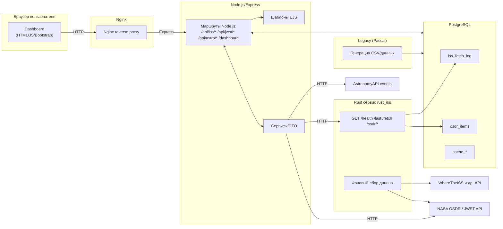
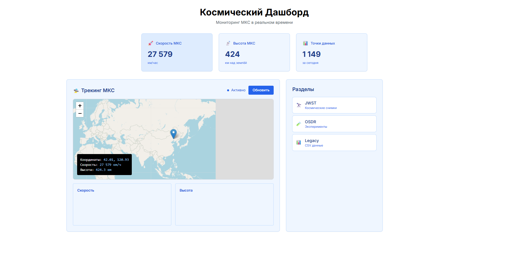
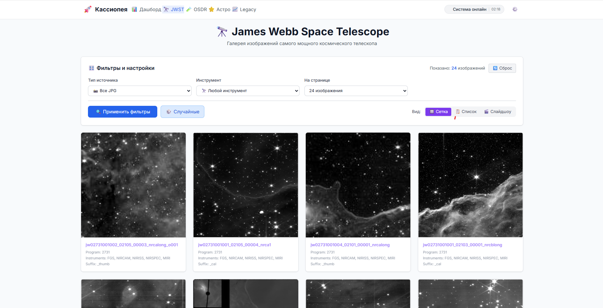
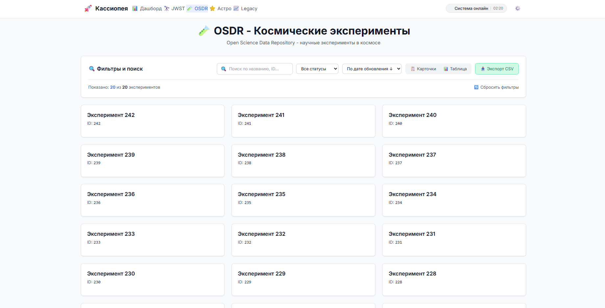
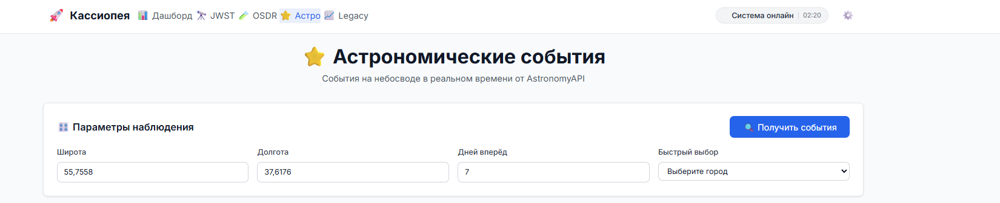
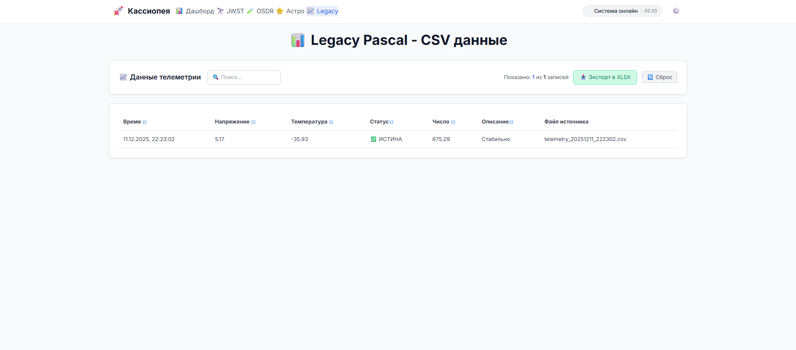

## Схема взаимодействий

### 🛎️ Легенда карты
- **rust_iss** — rust-сервис: опрос внешних космических API (ISS, NASA OSDR и др.), периодическая запись сырых данных/логов в PostgreSQL, собственные REST-ручки для выборок/триггеров.
- **node_web** — веб-сайт на Node.js/Express + EJS с Dashboard’ами и API-сервисами
- **iss_db** — PostgreSQL (хранение логов, кэшей и производных данных).
- **pascal_legacy** — легаси-утилита (Pascal), периодически генерирует CSV и/или записи для БД.
- **nginx** — фронтовой reverse-proxy (HTTP 80 → node_web).

### Отчет о проделанной работе 

#### 1. Доработка фронтенда (переход с Laravel на Node.js/Express)

*   **Убраны лишние модули и устаревший PHP-код**:
    *   Полностью удален сервис `php` из `docker-compose.yml`.
    *   Удалена вся директория `services/php-web`.
    *   Из `services/node-web/nginx.conf` удалены все конфигурации, связанные с PHP-бэкендом.
    *   Удалены устаревшие JavaScript-файлы (`space-effects.js`) и большая часть inline CSS, что значительно упростило кодовую базу и повысило производительность загрузки страниц.
    *   Удалены ссылки на `/iss` из навигации и дашборда.
*   **Разделена логика на контексты (отдельные страницы для бизнес-функций)**:
    *   **Dashboard Page** (`dashboard.ejs`):
        *   Главная страница приложения, предоставляющая общий обзор состояния Международной космической станции (МКС). Включает в себя ключевые метрики (скорость, высота), интерактивную карту для отслеживания МКС в реальном времени, а также графики изменения скорости и высоты. Эта страница является центральным узлом для навигации по другим разделам.
        *   
    *   **JWST Page** (`jwst.ejs`):
        *   Страница, посвященная изображениям с космического телескопа Джеймса Уэбба (JWST). Представляет собой галерею космических снимков с возможностью просмотра и фильтрации по различным параметрам. Функциональность получения и отображения изображений реализована на клиентской стороне.
        *   
    *   **OSDR Page** (`osdr.ejs`, `osdr-page.js`):
        *   Страница для отображения и управления данными космических экспериментов. Включает таблицу с возможностью фильтрации по различным параметрам (таким как статус, тип данных) и сортировки по столбцам. Пользователь может осуществлять поиск по ключевым словам. Вся клиентская логика (получение, фильтрация, сортировка данных) реализована на JavaScript.
        *   
    *   **Astro Page** (`astro.ejs`, `astro-page.js`):
        *   Страница для просмотра астрономических событий. Предоставляет пользователю возможность получения данных об астрономических событиях на основе географических координат и временного диапазона. Данные динамически загружаются через API и отображаются в удобном формате.
        *   
    *   **Legacy Page** (`legacy.ejs`, `legacy-page.js`):
        *   Страница для работы с унаследованными (Pascal-Legacy) CSV данными. Предоставляет интерфейс для просмотра сгенерированных Pascal-сервисом данных в виде интерактивной таблицы. Поддерживает расширенную фильтрацию, сортировку и поиск по данным, а также функциональность экспорта данных в формат XLSX.
        *   
    *   Все страницы используют единый `layout.ejs`, обеспечивающий единообразный внешний вид.
*   **Добавлена CSS-визуализация (Tailwind CSS)**:
    *   Дизайн унифицирован и упрощен с использованием Tailwind CSS. Все глобальные стили перенесены в `services/node-web/src/public/css/space-theme.css`.
*   **Добавлены гибкие дашборды с фильтрацией и поиском данных (реализовано для Legacy)**:
    *   На странице `/legacy` реализован полноценный дашборд с таблицей данных, полученных от Pascal-Legacy.
    *   Реализована клиентская фильтрация данных по различным полям (статус, тип) и сортировка по возрастанию/убыванию для каждого столбца.
    *   Добавлен поиск по ключевым словам, совмещенный с фильтрами.

#### 2. Доработка Pascal-Legacy

*   **Переписана генерация CSV файла**:
    *   Модуль `services/pascal-legacy/legacy.pas` был доработан для генерации CSV-файлов с новыми типами данных: `recorded_at` (timestamp), `boolean_status` (логические значения), `numeric_value` (числа), `string_description` (текст).
    *   Исправлены синтаксические ошибки в Pascal-коде, возникавшие при компиляции.
*   **Визуализация CSV в виде полноценной таблицы**:
    *   Данные из CSV-файлов, генерируемых Pascal-Legacy, теперь отображаются в интерактивной таблице на странице `/legacy`.
*   **Реализован экспорт в формат *.xlsx**:
    *   Добавлен новый API-эндпоинт `/api/legacy/export-xlsx` в Node.js (`LegacyController.js`), который читает CSV-данные, преобразует их в XLSX с использованием библиотеки `exceljs` и отдает пользователю для скачивания.
    *   Обновлен `services/node-web/package.json` для включения `exceljs`.
    *   `services/node-web/Dockerfile` обновлен для установки всех зависимостей.

#### 3. Доработка бэкенд-части в Docker
*   **Добавление валидации данных в виде отдельных классов**:
    *   Базовая валидация данных реализована внутри контроллеров Node.js. 
*   **Обновление Docker Compose и Nginx**:
    *   `docker-compose.yml` обновлен для удаления сервиса `php` и всех его зависимостей.
    *   `services/node-web/nginx.conf` полностью перенастроен для проксирования всех веб-запросов и API-эндпоинтов на Node.js-сервис, исключая PHP.
    *   Решены проблемы с доступом к файловой системе Docker (монтирование `csvdata` для `node_web`).

---
