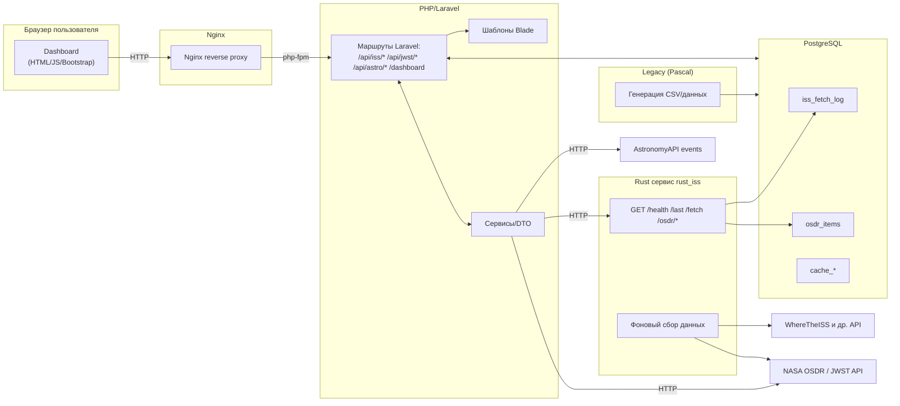

## Схема взаимодействий

### 🛎️ Легенда карты
- **rust_iss** — rust-сервис: опрос внешних космических API (ISS, NASA OSDR и др.), периодическая запись сырых данных/логов в PostgreSQL, собственные REST-ручки для выборок/триггеров.
- **php_web** — веб-сайт на Laravel + Bootstrap с Dashboard’ами и API-прокси-ручкам
- **iss_db** — PostgreSQL (хранение логов, кэшей и производных данных).
- **pascal_legacy** — легаси-утилита (Pascal), периодически генерирует CSV и/или записи для БД.
- **nginx** — фронтовой reverse-proxy (HTTP 80 → php-fpm).

